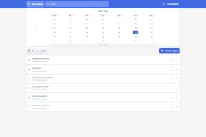
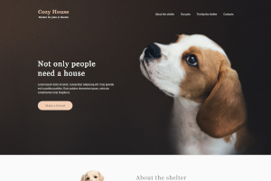

### Hi there 👋

## Technology stack
- HTML, CSS, SCSS, BEM;
- JavaScript, TypeScript;
- React, Redux Toolkit;
- Gulp, Webpack;
- Git, GitHub.

## Portfolio
<table>
  <tr>
    <th>Task manager</th>
    <th>Calorie calculator</th>
    <th>Cakes to order</th>
  </tr>
  <tr>
    <td></td>
    <td></td>
    <td></td>
  </tr>
  <tr>
    <th>Cozy House</th>
    <th>Resto</th>
    <th>Bicycle</th>
  </tr>
  <tr>
    <td></td>
    <td></td>
    <td></td>
  </tr>
</table>

## Stats

